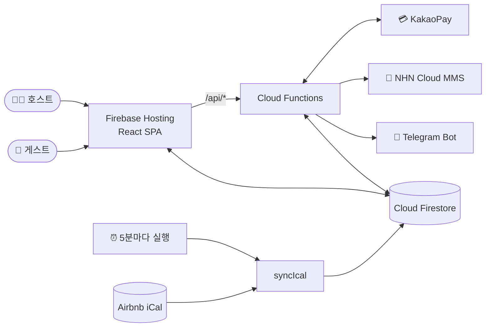

<div align="center">

# 🏡 나믄자리

**남아있는 것에서 가치있는 것으로 바뀌는 순간**

오래된 공간을 새로운 가치로 다시 쓰는 숙소, 나믄자리의 예약 웹 애플리케이션입니다.

[](https://nameun-jari.web.app/)


[🌐 사이트 바로가기](https://nameun-jari.web.app/) · [🔎 예약 조회](https://nameun-jari.web.app/lookup)

</div>

---

## 🛖 운영 공간

| 공간 | 지역 | 유형 | 소개 | 페이지 |
| --- | --- | --- | --- | --- |
| **백년한옥별채** | 강원 동해 | 숙소 | 백년의 역사를 품은 전통 한옥의 별채 | [`/forest`](https://nameun-jari.web.app/forest) |
| **블로뉴숲** | 경기 포천 | 숙소 | 깊은 숲속에서 누리는 평화로운 휴식 | [`/blon`](https://nameun-jari.web.app/blon) |

> 온오프스테이·온오프스페이스·묵호쉴래 등 운영을 중단한 공간의 코드도 일부 남아 있습니다.

## ✨ 주요 기능

- **📅 실시간 예약 캘린더** — 자체 예약과 에어비앤비 예약을 하나의 달력에서 보여주어 중복 예약을 막습니다.
- **🔄 에어비앤비 iCal 동기화** — Cloud Scheduler가 5분마다 에어비앤비 캘린더를 가져와 Firestore에 반영합니다.
- **💰 시즌별 자동 요금 계산** — 평일 / 금요일 / 주말 / 공휴일, 여름 성수기, 극성수기 요금과 인원·반려견·바베큐·불멍 옵션을 자동으로 합산합니다.
- **💳 결제** — 계좌이체와 카카오페이 결제를 모두 지원합니다.
- **🔔 호스트 알림** — 새 예약이 들어오면 숙소별 텔레그램 채널로 즉시 알림이 갑니다.
- **📩 게스트 안내 문자** — 예약 즉시 NHN Cloud MMS로 예약 정보와 숙소 이용 안내를, 입금이 확인되면 확정 안내를 보냅니다.
- **🔎 예약 조회** — 게스트가 예약번호로 자신의 예약 내역을 확인할 수 있습니다.
- **🛠 관리자 페이지** — 예약 현황 확인과 입금 확정 등 운영 업무를 웹에서 처리합니다.

## 🏗 아키텍처

서버를 따로 두지 않고 Firebase만으로 동작하는 서버리스 구조입니다.



### 예약 흐름

1. 게스트가 캘린더에서 날짜를 고르고 인원과 옵션을 입력합니다.
2. 카카오페이로 결제하거나 계좌이체를 선택합니다.
3. 예약이 Firestore에 저장되고, 호스트에게는 텔레그램 알림이, 게스트에게는 예약번호와 숙소 안내 문자가 갑니다.
4. 계좌이체의 경우 입금이 확인되면 예약이 확정되고, 게스트에게 확정 안내 문자가 발송됩니다.

## 🧰 기술 스택

| 구분 | 사용 기술 |
| --- | --- |
| **Frontend** | React 19, Vite, React Router, Framer Motion, React Calendar, React Modal, Lucide Icons |
| **Backend** | Firebase Cloud Functions (Node 20), node-ical |
| **Database** | Cloud Firestore |
| **Hosting** | Firebase Hosting |
| **외부 연동** | KakaoPay, Telegram Bot API, NHN Cloud SMS/MMS, Airbnb iCal, Google Analytics |

## 📁 프로젝트 구조

```
nameun-jari/
├── src/
│   ├── App.jsx              # 랜딩 페이지 및 라우팅
│   ├── firebase.js          # Firebase 초기화
│   ├── components/
│   │   ├── ForestPage/      # 백년한옥별채 소개
│   │   ├── BlonPage/        # 블로뉴숲 소개
│   │   ├── CommonCalendar/  # 공통 예약 캘린더
│   │   ├── CommonReservation/ # 공통 예약 폼 · 요금 계산
│   │   ├── ReservationLookup/ # 예약 조회
│   │   ├── Admin/           # 관리자 페이지
│   │   └── Payment*/        # 카카오페이 결제 결과 페이지
│   ├── constants/price.js   # 숙소별 요금표
│   └── utils/               # Firestore · API · 날짜 유틸
├── functions/
│   ├── index.js             # Cloud Functions 진입점
│   ├── updateIcal.js        # iCal 동기화 로직
│   └── mms.js               # 숙소별 안내 문자 템플릿
├── firebase.json            # Hosting 리라이트 · 캐시 설정
└── firestore.rules          # Firestore 보안 규칙
```

